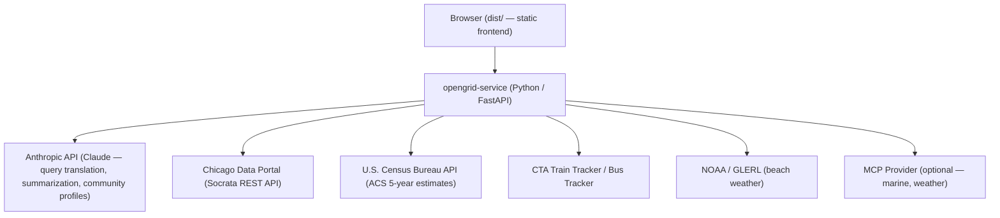

OpenGrid is an open-source, interactive map platform for exploring Chicago open data. It supports natural language queries powered by AI, community area trend analysis, toggleable map layers, event listings from Chicago institutions, and plain-language summarization of results.

This fork is self-hosted and pulls live data from the [Chicago Data Portal](https://data.cityofchicago.org) (Socrata) via a custom Python service layer.

## Features

- **AI-powered natural language search** — Type queries like "crimes in Logan Square last month" or "rodent complaints near schools" and the app translates them into structured Socrata SoQL queries using Claude.
- **Community Trends** — Select any of Chicago's 77 community areas from the sidebar or click a neighborhood label on the map to see Census ACS indicators (population, income, education, housing, commute) alongside citywide comparisons and interactive charts.
- **Map layers** — Toggle overlays for CTA train stations (with real-time arrivals), CTA bus stops, Metra commuter rail, Chicago Public Library branches, CPS schools, parks, civic facilities, Divvy bike share stations, and Open Air quality sensors.
- **Events and announcements** — Browse upcoming events from Chicago Public Library branches, Chicago Park District, Navy Pier, and professional sports home games (Cubs, Sox, Bulls, Bears, Blackhawks).
- **Beach data** — View real-time beach weather station readings (water temperature, wave height, wind) and beach DNA / E. coli test results for Chicago lakefront beaches.
- **Geolocation-aware proximity search** — Queries like "food inspections around me" or "crimes near me" request the browser's GPS and filter results within a configurable radius.
- **Neighborhood boundary display** — Searching for a community area (e.g., "Logan Square") or a data query scoped to one draws the boundary outline on the map.
- **Multi-dataset queries** — Ask for two datasets at once ("show me crimes and 311 requests in Pilsen") and both layers render together.
- **Plain-language summary** — A "Summarize" button sends the current results to Claude and displays a one-sentence summary with key highlights.
- **Advanced search panel** — Traditional filter-based data exploration (still available via "Find Data").

## Architecture



The frontend is a static site served from `dist/`. The service layer (`opengrid-service/`) implements the OpenGrid REST API contract and is the only component that talks to external APIs.

## System requirements

### Frontend
- Any modern web server (nginx, Apache, Python `http.server`, etc.)
- Node.js + npm (for rebuilding the JS/CSS bundles — optional if using pre-built `dist/`)

### Service layer
- Python 3.11+
- An [Anthropic API key](https://console.anthropic.com/)
- A [U.S. Census Bureau API key](https://api.census.gov/data/key_signup.html) (required for Community Trends)
- Optional: a [Socrata App Token](https://dev.socrata.com/foundry/data.cityofchicago.org/) to avoid throttling
- Optional: [CTA Train Tracker](https://www.transitchicago.com/developers/traintrackerapply/) and [Bus Tracker](https://www.transitchicago.com/developers/bustrackerapply/) keys for real-time transit data

### Browser support
Chrome, Firefox, Safari, Edge. Also tested on iOS Safari and Android Chrome.

## Installation

### 1. Clone the repository

```bash
git clone https://github.com/tomschenkjr/opengrid.git
cd opengrid
```

### 2. Set up the service layer

```bash
cd opengrid-service
python -m venv .venv
source .venv/bin/activate        # Windows: .venv\Scripts\activate
pip install -r requirements.txt
```

Create a `.env` file in `opengrid-service/`:

```env
ANTHROPIC_API_KEY=sk-ant-...
CENSUS_API_KEY=your_census_key       # required for Community Trends
SOCRATA_APP_TOKEN=your_socrata_token # optional but recommended
JWT_SECRET=a_random_secret_string    # required for auth tokens
CORS_ORIGINS=*                       # restrict in production
PORT=8080
```

Start the service:

```bash
uvicorn main:app --host 0.0.0.0 --port 8080 --reload
```

The service is available at `http://localhost:8080`. Health check: `GET /health`.

### 3. Configure the frontend endpoint

Edit `config/EnvSettings.js` to point at your service:

```js
ogrid.Config.service.endpoint = 'http://localhost:8080/opengrid-service/rest';
```

### 4. Serve the frontend

Serve the `dist/` directory from any static web server:

```bash
# Quick local test
python -m http.server 8000 --directory dist
```

Open `http://localhost:8000` in your browser.

### 5. (Optional) Rebuild the dist bundle

> **Note:** The build pipeline uses Gulp 3, which is incompatible with Node.js v12+. If you need to rebuild after editing source files, use the `uglifyjs` and CSS concatenation approach described in the project wiki, or downgrade to Node.js v10.

## Available datasets

| Dataset             | Socrata ID   | Description                                                    |
|---------------------|--------------|----------------------------------------------------------------|
| Crimes              | `ijzp-q8t2`  | Chicago Police Department incident reports                     |
| Food Inspections    | `4ijn-s7e5`  | CDPH restaurant and food establishment inspections             |
| Building Permits    | `ydr8-5enu`  | City-issued building permits                                   |
| 311 Service Requests| `v6vf-nfxy`  | All 311 service requests (graffiti, potholes, rodents, etc.)   |

Proximity-only datasets (used as spatial anchors, not shown as primary layers):

| Dataset     | Socrata ID   | Used for               |
|-------------|--------------|------------------------|
| CPS Schools | `kh4r-387c`  | "near schools" queries |

## Natural language search examples

The search bar accepts plain English. Examples:

- `crimes in Logan Square last month`
- `rodent complaints near me`
- `failed food inspections in the Loop`
- `building permits near Wicker Park this year`
- `crimes and 311 requests in Pilsen`
- `West Town` *(draws the neighborhood boundary)*
- `graffiti removal requests in Ward 35 near a Starbucks`

After results appear, click **Summarize** for a one-sentence AI-generated overview.

## Service layer API

All routes are prefixed with `/opengrid-service/rest`.

### Search and data

| Method | Path               | Description                                  |
|--------|--------------------|----------------------------------------------|
| `POST` | `/search/smart`    | Natural language → GeoJSON results           |
| `POST` | `/search/summarize`| Generate plain-language summary of results   |
| `GET`  | `/datasets`        | List available datasets                      |
| `GET`  | `/capabilities`    | Service capabilities                         |

### Geography and community trends

| Method | Path                                         | Description                                  |
|--------|----------------------------------------------|----------------------------------------------|
| `GET`  | `/geography/community-areas`                 | List all 77 community areas                  |
| `GET`  | `/geography/community-areas/{n}/profile`     | ACS indicators + citywide comparison         |
| `GET`  | `/geography/community-areas/{n}/profile/summary` | AI plain-language summary of profile     |
| `GET`  | `/geography/community-areas/boundaries`      | GeoJSON community-area boundary outlines     |

### Stations and live data

| Method | Path                        | Description                                         |
|--------|-----------------------------|-----------------------------------------------------|
| `GET`  | `/stations/beach`           | Beach DNA / E. coli test results                    |
| `GET`  | `/stations/beach-weather`   | Real-time beach weather station observations        |
| `GET`  | `/stations/cta`             | CTA train stations (with real-time arrivals if key set) |
| `GET`  | `/stations/bus`             | CTA bus stops                                       |
| `GET`  | `/stations/metra`           | Metra commuter rail stations                        |
| `GET`  | `/stations/schools`         | CPS school locations                                |
| `GET`  | `/stations/libraries`       | Chicago Public Library branches                     |
| `GET`  | `/stations/parks`           | Chicago Park District parks                         |
| `GET`  | `/stations/civic`           | Civic facilities (police stations, fire stations)   |
| `GET`  | `/stations/divvy`           | Divvy bike share station status (live GBFS)         |
| `GET`  | `/stations/openair`         | Open Air quality sensor readings                    |

### Events

| Method | Path                    | Description                                          |
|--------|-------------------------|------------------------------------------------------|
| `GET`  | `/events/library`       | Upcoming Chicago Public Library events               |
| `GET`  | `/events/sports`        | Chicago sports home games                            |
| `GET`  | `/events/navypier`      | Navy Pier events                                     |
| `GET`  | `/events/parkdistrict`  | Chicago Park District events                         |

## Environment variables

| Variable               | Required                  | Default | Description                                         |
|------------------------|---------------------------|---------|-----------------------------------------------------|
| `ANTHROPIC_API_KEY`    | Yes                       | —       | Anthropic API key for Claude                        |
| `CENSUS_API_KEY`       | Yes (Community Trends)    | —       | U.S. Census Bureau API key for ACS data             |
| `ACS_YEAR`             | No                        | `2023`  | ACS 5-year vintage to query                         |
| `SOCRATA_APP_TOKEN`    | No                        | —       | Socrata app token (avoids throttling)               |
| `SOCRATA_SECRET_TOKEN` | No                        | —       | Socrata secret token                                |
| `JWT_SECRET`           | No                        | —       | Secret for signing auth tokens                      |
| `CORS_ORIGINS`         | No                        | `*`     | Comma-separated allowed origins                     |
| `PORT`                 | No                        | `8080`  | Port the service listens on                         |
| `MCP_SERVER_URL`       | No                        | —       | SSE endpoint for optional MCP provider              |
| `CTA_TRAIN_TRACKER_KEY`| No                        | —       | CTA Train Tracker API key (real-time arrivals)      |
| `CTA_BUS_TRACKER_KEY`  | No                        | —       | CTA Bus Tracker API key (real-time predictions)     |

## Submit a bug

Use the [issue tracker](../../issues/) to report bugs. Please include:

- Description of the bug
- Steps to reproduce
- Expected vs. actual behavior
- Screenshots if applicable
- Browser and OS

## Contributing

See [CONTRIBUTING.md](CONTRIBUTING.md) for guidelines.
